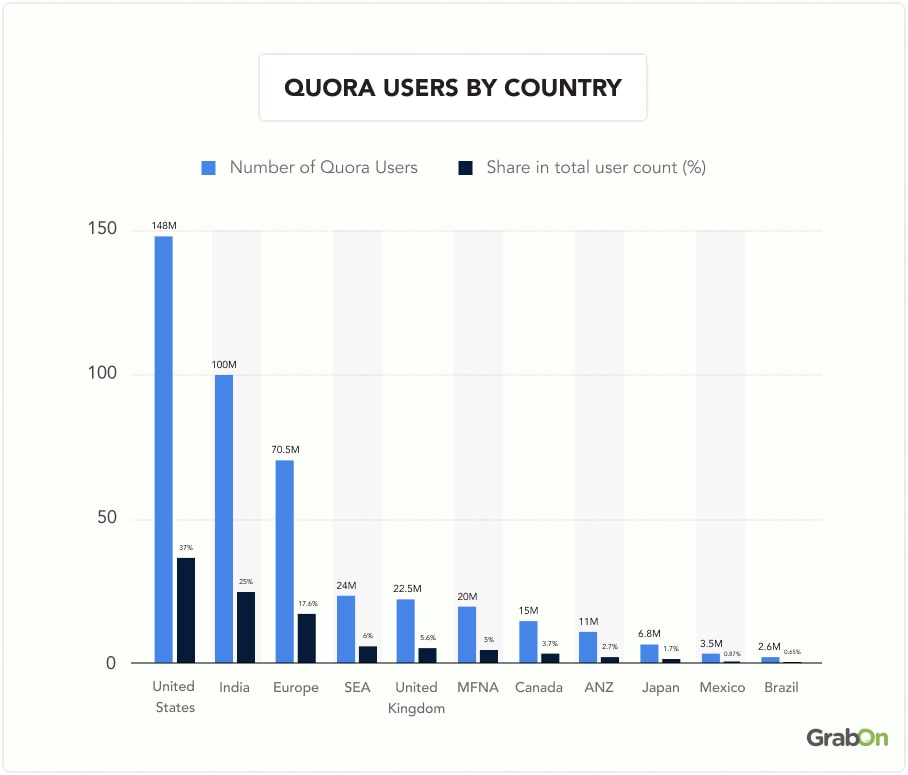
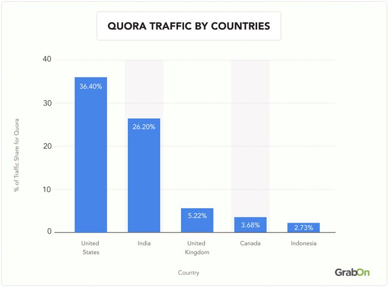
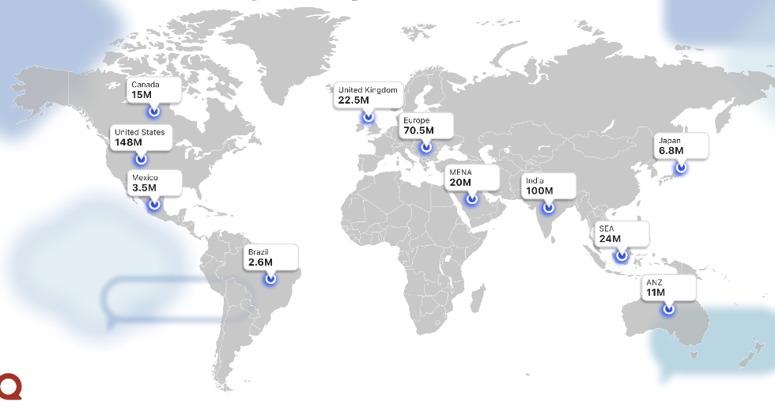
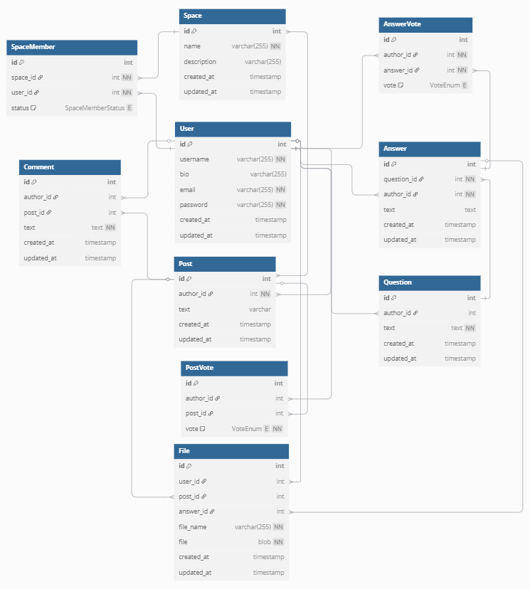

# Проектирование высоконагруженного сервиса Quora
## 1. Тема и целевая аудитория
Quora - это социальный сервис вопросов и ответов, предназначен для обмена знаниями.

### MVP
1. Задание вопросов
2. Ответы на вопросы
3. Посты
4. Оценки ответов и постов
5. Комментарии
6. Сообщества

### Ключевые продуктовые решения
Анонимные вопросы, тематические сообщества (Spaces) и алгоритмы рекомендации

### Целевая аудитория

[[1]]

[[1]]

Распределение пользователей по устройствам [[1]]:
|Устройства|% пользователей|
|-|:-:|
|Mobile Web|76.62%|
|Desktop|23.38%|

## 2. Расчет нагрузки
### Продуктовые метрики
* MAU: 400M [[2]]
* DAU: 27M [[4]]
* Вопросов в день: 5000-7000 [[4]]
* Среднее количество ответов на вопрос: 5 [[4]]
* Количество тем: 300000 [[2]]
* Среднее время сессии:  4 минуты 11 секунд [[6]]
* Коэффициент активности (отношение MAU к числу зарегистрированных пользователей): 0.4
* Среднее количество просматриваемых вопросов одним пользователем в день: 3
* Среднее количество просматриваемых постов одним пользователем в день: 14
* Среднее количество оценок на пост в ленте: 1137 [[7]]
* Среднее количество оценок на ответ: 83.7 [[7]]
* Среднее количество комментариев на 1 пост в ленте: 62 [[7]]
* Среднее количество комментариев на ответ: 17.4 [[7]]
* Среднее количество просматриваемых пользователем комментариев к посту: 5
* Соотношение количества пользователей и сообществ: 1000

### Технические метрики
* Размер хранения в разбивке по типам данных
* Сетевой трафик
* RPS в разбивке по типам запросов

### Расчет RPS
Расчитывать будем 2 основные операции: создание и чтение. Влияние запросов изменения и удаления на общую нагрузку системы является незначительной.

1. Аккаунты пользователей
    1. Создание\
 Всего зарегистрированных аккаунтов 400M / 0.4 = 1B. Тогда в среднем за время жизни сервиса RPS на создание аккаунта равен: \
RPS = 1B / (2025 - 2009) / 365 / 86400 = 1.982/с
    1. Чтение \
RPS на чтение аккаунтов примем равным DAU, деленному на количество секунд в сутках: \
RPS = 27M / 86400 = 312.5/с

1. Вопросы
    1. Создание \
В день задается 7000 вопросов. Значит RPS на создание вопроса равен: \
RPS = 7000 / 24 / 3600 = 0.081/с
    1. Чтение \
Данных о количестве просматриваемых вопросов нет. Поэтому примем, что средний пользователь просматривает 3 вопроса в день. Получим RPS на чтение вопросов: \
RPS = 27*10^6 * 3 / (24 * 3600) = 937.5/с

1. Ответы \
Среднее количество ответов на вопрос - 5. Для расчета RPS ответов умножим это значение на RPS вопросов.
    1. Создание \
RPS = 5 * 0.081 = 0.405/с
    1. Чтение \
RPS = 937.5/с
Ответов/с = 5 * 937.5 = 4687.5/с

1. Посты \
Количество постов примерно равно количеству вопросов, поэтому RPS постов примем равным RPS вопросов.
    1. Создание \
RPS = 0.081/с
Данных о количестве создаваемых постов нет. Поэтому примем, что средний пользователь просматривает 2 пачки постов:
    1. Чтение \
RPS = 27M * 2 / (24 * 3600) = 625/с \
Посты загружаются пачкой по 7 постов: \
Постов/с = 625/с * 7 = 4375/с

1. Оценки \
Среднее количество оценок на пост в ленте - 1137, на ответ - 83.7
    1. Создание \
RPS = 1137 * 0.081/с + 83.7 * 0.405/с = 126.024/с
    1. Чтение \
RPS на чтение оценок примем равным сумме RPS на чтение постов и ответов
RPS = 625/с + 937.5/с = 1562.5/с
Оценок/с = 4687.5/с + 4375/с = 9062.5/с

1. Комментарии
В среднем на один пост в ленте пишется 62 комментариев, на ответ - 17.4
    1. Создание \
RPS = 62 * 0.081/с + 17.4 * 0.405/с = 12.072/с
    1. Чтение \
Будем считать, что пользователь в среднем просматривает 5 комментариев к посту или ответу: \
Комментариев/с = 5 * 4375/с + 5 * 4687.5/с = 45312.5/с \
При этом будем считать, что в запросе отправляется пачка из 5 комментариев: \
RPS = 45312.5/с / 5 = 9062.5

1. Сообщества
Примем, что в среднем на каждую 1000 пользователей приходится 1 сообщество: \
Всего сообществ = 1B / 1000 = 1M
    1. Создание \
RPS = 2.378/с / 1000 = 0.002/с
    1. Чтение \
Примем RPS на чтение сообщества равным RPS на чтение поста: \
RPS = 4375/с

### Расчет трафика

В кодировке UTF-8 каждый символ занимает максимум 4 байта. Примем размер одного изображения равным 500 Кб.

1. Пользователи
Среднее количество в имени пользователя: 30 символов. Описание: 255 символов. Тогда размер данных одного пользователя равен (30 байт + 255) * 4 байт + 500 Кб = 501.113 Кб \
Трафик на создание пользователя = 500 Кб * 2.378/с =  7.759 Мбит/с \
Трафик на чтение пользователя = 500 Кб * 312.5/с = 1.195 Гбит/с \
Суммарный трафик пользователей = 1.202 Гбит/с

1. Вопросы \
Среднее количество символов в вопросе - 120. Тогда размер одного вопроса равен 120 * 4 = 480 байт. 
Трафик создания вопросов = 480 байт * 0.081/с = 38.889 байт/с \
Трафик чтения вопросов = 480 байт * 3125/с = 439.453 Мб/с \
Суммарный трафик вопросов = 439.491 Кб/с

1. Ответы \
Среднее количество символов в ответе - 918, изображений - 0.6. Тогда размер одного ответа равен 918 * 4 байт + 0.6 * 500 Кб = 303.586 Кб. \
Трафик на создание ответа = 303.586 Кб * 0.405/с = 122.98 Кб/с
Трафик на чтение ответов = 303.586 Кб * 15630/с = 1.357 Гб/с
Суммарный трафик ответов = 1.357 Гб/с

1. Посты \
Среднее количество символов в одном посте - 968, изображений - 1.8. Тогда размер одного поста равен 968 * 4 байт + 1.8 * 500 Кб = 903.781 Кб. \
Трафик на создание поста = 1.8 Мб * 0.081/с = 73.223 Кб/с \
Трафик на чтение постов = 1.8 Мб * 3125/с = 3.771 Гб/с \
Суммарный трафик постов = 3.771 Гб/с

1. Оценки \
При оценивании в теле запроса передается приблизительно 512 байт данных. \
Трафик на оценивание = 512 байт * 181.6/с = 63.012 Кб/с \
Данные об оценках приходят вместе с запросом поста или ответа. Поэтому размер одного лайка можно принять равным 20 байт. \
Трафик чтения оценок = 20 байт * 187500/с = 177.002 Кб/с \
Суммарный трафик оценок = 240.014 Кб/с

1. Комментарии \
Среднее количество символов в одном комментарии - 87. Тогда размер одного комментария = 87 * 4 байт = 348 байт. \
Трафик на создание комментариев = 348 байт * 18.6/с = 4.103 Кб/с \
Трафик на чтение комментариев = 348 байт * 187500/с = 15.038 Мб/с \
Суммарный трафик комментариев = 15.042 Мб/с

1. Сообщества \
Среднее количество символов в названии + описании сообщества - 90. Тогда размер одного сообщества = 90 * 4 байт + 500 Кб = 500.352 Кб \
Трафик на создание сообщества = 500.352 Кб * 2.378/с = 0.992 Кб/c \
Трафик на чтение сообщества = 500.352 Кб * 3125/с = 2.088 Гб/с

### Расчет хранилища

Расчитаем объем, на который нужно расширять хранилище каждый год. Для этого трафик на создание хранимой сущности будем умножать на число секунд в году:

1. Пользователи \
Рост хранилища = 19.028 Мбит/с * 365 * 86400 = 29.169 Тб/год

1. Вопросы \
Рост хранилища = 38.9 байт/с * 365 * 86400 = 1.142 Гб/год

1. Ответы \
Рост хранилища = 250 Кб/с * 365 * 86400 = 3.612 Тб/год

1. Посты \
Рост хранилища = 150 Кб/с * 365 * 86400 = 2.151 Тб/год

1. Комментарии \
Рост хранилища = 6.3 Кб/с * 365 * 86400 = 123.383 Гб/год

1. Сообщества \
Рост хранилища = 2.436 Кб/c * 365 * 86400 = 29.823 Гб/год

Суммарно получим рост хранилища на 35.14 Тб/год. Для расчета объема хранилища примем этот рост постоянным на протяжении 10 лет. Тогда получим: \
Объем хранилища: 35.14 Тб/год * 10 лет = 351.397 Тб

### Результаты расчета

* Размер хранения

|Тип данных|Рост, Тб/год|Размер, Тб|
|-|:-:|:-:|
|Аккаунты пользователей|29.169|291.686|
|Вопросы|0.001|0.011|
|Ответы|3.612|36.12|
|Посты|2.151|21.506|
|Комментарии|0.185|1.853|
|Оценки|0.083|0.833|
|Сообщества|0.072|0.716|

* Сетевой трафик

Пиковый трафик примем в 2 раза больше среднего

|Тип данных|Средний|Пиковый|Суммарный суточный|
|-|:-:|:-:|:-:|
|Аккаунты пользователей|1.202 Гбит/с|2.405 Гбит/с|12.681 Тб|
|Вопросы|11.4 Мбит/с|22.8 Мбит/с|120.7 Гб|
|Ответы|10.858 Гбит/с|21.716 Гбит/с|114.518 Тб|
|Посты|30.168 Гбит/с|60.335 Гбит/с|318.173 Тб|
|Оценки|3.57 Мбит/с|7.14 Мбит/с|37.7 Гб|
|Комментарии|498 Мбит/с|996 Мбит/с|5.1 Тб|
|Сообщества|16.701 Гбит/с|33.402 Гбит/с|176.144 Тб|
|Суммарный|59.052 Гбит/с|118.103 Гбит/c|622.81 Пб|

* RPS

|Тип данных|RPS|
|-|:-:|
|Аккаунты пользователей|314.482|
|Вопросы|937.581|
|Ответы|937.5|
|Посты|625.081|
|Оценки|1688.524|
|Комментарии|1574.572|
|Сообщества|625.002|
|Суммарный|6703.147|

## 3. Глобальная балансировка нагрузки

Распределение MAU по регионам [[2]]:

Получим следующее распределение пользователей по частям света:
* Северная Америка: 41.6 %
* Азия: 40.4 %
* Европа: 23.2 %
* Австралия: 2.7 %
* Южная Америка: 0.7 %

Целесообразно располагать датацентры в Северной Америке, Азии и Европе. Нагрузка на датацентры распределена неравномерно, поэтому необходимо балансировать нагрузку с учетом географического расположения клиентов и датацентров. Для этого будем использовать latency-based DNS. Расположим 2 датацентра в Северной Америке, 2 в Азии и 1 в Европе. Тогда пиковый трафик в датацентрах составит 118.103 Гбит/c / 5 = 23.582 Гбит/с

## 4. Локальная балансировка нагрузки

Для локальной балансировки нагрузки будем использовать L7 балансировку.

Балансировку на уровне L7 будем проводить с помощью nginx. Это повысит надежность сервиса и она будет зависеть только от надежности железа, поскольку нагрузка будет балансироваться с упавших бэкендов на рабочие, а nginx способен долго работать без перезапуска. Также это обеспечит SSL termination внутри датацентра. Помимо этого можно обеспечить раздачу статики и кэширование ответов динамики на популярные запросы. Также будем использовать сжатие контента (gzip) для уменьшения трафика.

nginx позволит экономить количество блокирующих соединений к application серверам. В качестве алгоритма балансировки будем использовать least connections.

Для обеспечения надежности L7 балансировщиков будем использовать keepalived.

### SSl termination

Расчитаем нагрузку на терминацию SSL. На каждый L7 балансировщик будет приходить RPS = 231766/c / 5 = 1340.629/с

Примем средний размер SSL-сессии равным 1 Кб. Примем средную нагрузку на одно SSL-соединение равным 50 мс. Тогда: \
Объем данных = RPS * 1 Кб = 10.474 Мбит/с \
Количество ядер = RPS * 50 мс = 1340.629/с * 50 мс = 67

## 5. Логическая схема БД
### Логическая схема данных

Схема [[5]]:

### Описание таблиц

Общие поля:
* id (int) - уникальный идентификатор
* created_at (timestamp) - время создания сущности
* updated_at (timestamp) - время обновления сущности

|Таблица|Описание|Поля|
|-|:-:|:-:|
| User | Хранит информацию о пользователях | username (varchar(255)) - имя пользователя, bio (varchar(255)) - описание пользователя, email (varchar(255)) - электронная почта, password (varchar(255)) - пароль |
| Question | Хранит информацию о вопросах | author_id (int) - идентификатор автора вопроса, text (text) - текст вопроса|
| Answer | Хранит информацию об ответах | question_id (int) - идентификатор вопроса, author_id (int) - идентификатор автора ответа, text (text) - текст ответа|
| Post | Хранит информацию о постах | author_id (int) - идентификатов автора поста, text (text) - текст поста|
| Comment | Хранит информацию о комментариях | author_id (int) - идентификатор автора комментария, post_id (int) - text (text) - текст комментария |
| PostVote | Хранит информацию об оценках постов | author_id (int) - идентификатор автора оценки, post_id (int) - идентификатор поста, vote (enum) - оценка |
| AnswerVote | Хранит информацию об оценках ответов | author_id (int) - идентификатор автора оценки, answer_id (int) - идентификатор ответа, vote (enum) - оценка |
| Space | Хранит информацию о сообществах | name (varchar(255)) - название сообщества | description (varcher(255)) - описание сообщества |
| File | Хранит информацию о файлах | user_id (int) - идентификатор пользователя, к которому относится файл (аватар), post_id (int) - идентификатор поста, к которому относится файл, answer_id (int) - идентификатор ответа, к которому относится файл, file_name (varchar(255)) - название файла, file_url (varchar(255)) - адрес файла |

### Размер данных

| Таблица | Размер одной сущности | Количество записей | Размер таблицы |
|-|:-:|:-:|:-:|
| User | 1044 байт | 1 * 10^9 | 972.301 Гб |
| Question | 504 байт | 2.555 * 10^7 | 11.993 Гб |
| Answer | 3700 байт | 1.278 * 10^8 | 440.213 Гб |
| Post | 3896 байт | 2.555 * 10^7 | 92.706 Гб |
| Comment | 376 байт | 3.807 * 10^9 | 1.302 Тб |
| PostVote | 16 байт | 2.905 * 10^10 | 432.884 Гб |
| AnswerVote | 16 байт | 1.069 * 10^10 | 159.333 Гб |
| Space | 532 байт | 1 * 10^6 | 507.355 Мб |
| File | 540 байт | 1.124 * 10^9 | 565.095 Гб |

### Нагрузка

## 6. Физическая схема БД

## Список источников
1. [https://www.grabon.in/indulge/tech/quora-statistics/][1]
1. [https://business.quora.com/resources/reach-over-400-million-monthly-unique-visitors-on-quora/][2]
1. [https://startupbonsai.com/quora-statistics/][3]
1. [https://www.demandsage.com/quora-statistics/][4]
1. [https://dbdiagram.io/d/67d83f6075d75cc84464f069][5]
1. [https://foundationinc.co/lab/quora-statistics/][6]
1. [Статистика.xlsx][7]

[1]: https://www.grabon.in/indulge/tech/quora-statistics/
[2]: https://business.quora.com/resources/reach-over-400-million-monthly-unique-visitors-on-quora/
[3]: https://startupbonsai.com/quora-statistics/
[4]: https://www.demandsage.com/quora-statistics/
[5]: https://dbdiagram.io/d/67d83f6075d75cc84464f069
[6]: https://foundationinc.co/lab/quora-statistics/
[7]: ./Статистика.xlsx
