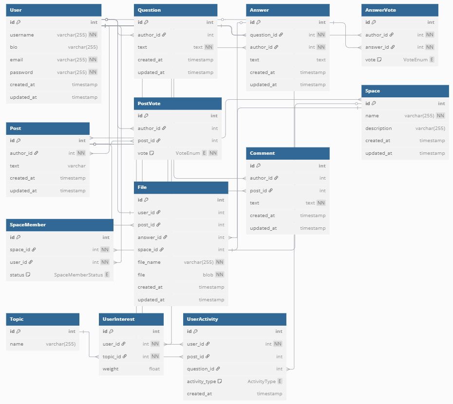
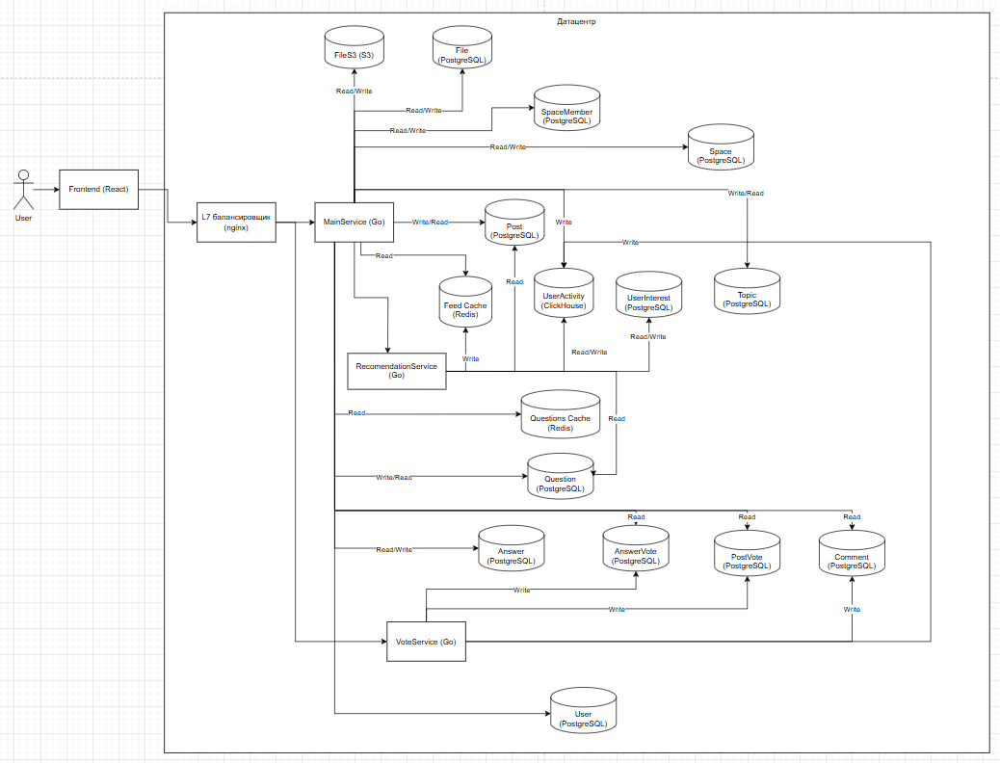

# Проектирование высоконагруженного сервиса Quora
## 1. Тема и целевая аудитория
Quora - это социальный сервис вопросов и ответов, предназначен для обмена знаниями.

### MVP
1. Задание вопросов
2. Ответы на вопросы
3. Посты
4. Оценки ответов и постов
5. Комментарии
6. Сообщества

### Ключевые продуктовые решения
Анонимные вопросы, тематические сообщества (Spaces) и алгоритмы рекомендации

### Целевая аудитория

[[1]]

[[1]]

Распределение пользователей по устройствам [[1]]:
|Устройства|% пользователей|
|-|:-:|
|Mobile Web|76.62%|
|Desktop|23.38%|

## 2. Расчет нагрузки
### Продуктовые метрики
* MAU: 400M [[2]]
* DAU: 27M [[4]]
* Вопросов в день: 5000-7000 [[4]]
* Среднее количество ответов на вопрос: 5 [[4]]
* Количество тем: 300000 [[2]]
* Среднее время сессии:  4 минуты 11 секунд [[6]]
* Коэффициент активности (отношение MAU к числу зарегистрированных пользователей): 0.4
* Среднее количество просматриваемых вопросов одним пользователем в день: 3
* Среднее количество просматриваемых постов одним пользователем в день: 14
* Среднее количество оценок на пост в ленте: 1137 [[7]]
* Среднее количество оценок на ответ: 83.7 [[7]]
* Среднее количество комментариев на 1 пост в ленте: 62 [[7]]
* Среднее количество комментариев на ответ: 17.4 [[7]]
* Среднее количество просматриваемых пользователем комментариев к посту: 5
* Соотношение количества пользователей и сообществ: 1000

### Технические метрики
* Размер хранения в разбивке по типам данных
* Сетевой трафик
* RPS в разбивке по типам запросов

### Расчет RPS
Расчитывать будем 2 основные операции: создание и чтение. Влияние запросов изменения и удаления на общую нагрузку системы является незначительной.


1. Аккаунты пользователей
    1. Создание\
 Всего зарегистрированных аккаунтов 400M / 0.4 = 1B. Тогда в среднем за время жизни сервиса RPS на создание аккаунта равен: \
RPS = 1B / (2025 - 2009) / 365 / 86400 = 1.982/с
    1. Чтение \
RPS на чтение аккаунтов примем равным DAU, деленному на количество секунд в сутках: \
RPS = 27M / 86400 = 312.5/с

1. Вопросы
    1. Создание \
В день задается 7000 вопросов. Значит RPS на создание вопроса равен: \
RPS = 7000 / 24 / 3600 = 0.081/с
    1. Чтение \
Данных о количестве просматриваемых вопросов нет. Поэтому примем, что средний пользователь просматривает 3 вопроса в день. Получим RPS на чтение вопросов: \
RPS = 27*10^6 * 3 / (24 * 3600) = 937.5/с

1. Ответы \
Среднее количество ответов на вопрос - 5. Для расчета RPS ответов умножим это значение на RPS вопросов.
    1. Создание \
RPS = 5 * 0.081 = 0.405/с
    1. Чтение \
RPS = 937.5/с \
Ответов/с = 5 * 937.5 = 4687.5/с

1. Посты \
Количество постов примерно равно количеству вопросов, поэтому RPS постов примем равным RPS вопросов.
    1. Создание \
RPS = 0.081/с
Данных о количестве создаваемых постов нет. Поэтому примем, что средний пользователь просматривает 2 пачки постов:
    1. Чтение \
RPS = 27M * 2 / (24 * 3600) = 625/с \
Посты загружаются пачкой по 7 постов: \
Постов/с = 625/с * 7 = 4375/с

1. Оценки \
Среднее количество оценок на пост в ленте - 1137, на ответ - 83.7
    1. Создание \
RPS = 1137 * 0.081/с + 83.7 * 0.405/с = 126.024/с
    1. Чтение \
RPS на чтение оценок примем равным сумме RPS на чтение постов и ответов
RPS = 625/с + 937.5/с = 1562.5/с
Оценок/с = 4687.5/с + 4375/с = 9062.5/с

1. Комментарии
В среднем на один пост в ленте пишется 62 комментариев, на ответ - 17.4
    1. Создание \
RPS = 62 * 0.081/с + 17.4 * 0.405/с = 12.072/с
    1. Чтение \
Будем считать, что пользователь в среднем просматривает 5 комментариев к посту или ответу: \
Комментариев/с = 5 * 625/с + 5 * 937.5/с = 7812.5/с \
При этом будем считать, что в запросе отправляется пачка из 5 комментариев: \
RPS = 7812.5/с / 5 = 1574.572/с

1. Сообщества
Примем, что в среднем на каждую 1000 пользователей приходится 1 сообщество: \
Всего сообществ = 1B / 1000 = 1M
    1. Создание \
RPS = 2.378/с / 1000 = 0.002/с
    1. Чтение \
Примем RPS на чтение сообщества равным RPS на чтение поста: \
RPS = 4375/с

### Расчет трафика

В кодировке UTF-8 каждый символ занимает максимум 4 байта. Примем размер одного изображения равным 500 Кб.

1. Пользователи \
Среднее количество в имени пользователя: 30 символов. Описание: 255 символов. Тогда размер данных одного пользователя равен (30 байт + 255) * 4 байт = 1.113 Кб \
Трафик на создание пользователя = 1.113 Кб * 2.378/с =  17.651 Кбит/с \
Трафик на чтение пользователя = 1.113 Кб * 312.5/с = 2.718 Мбит/с \
Суммарный трафик пользователей = 2.735 Мбит/с

1. Вопросы \
Среднее количество символов в вопросе - 120. Тогда размер одного вопроса равен 120 * 4 = 480 байт. 
Трафик создания вопросов = 480 байт * 0.081/с = 38.889 байт/с \
Трафик чтения вопросов = 480 байт * 3125/с = 439.453 Мб/с \
Суммарный трафик вопросов = 439.491 Кб/с

1. Ответы \
Среднее количество символов в ответе - 918, изображений - 0.6. Тогда размер одного ответа равен 918 * 4 байт = 3.586 Кб. \
Трафик на создание ответа = 3.586 Кб * 0.405/с = 1.453 Кб/с \
Трафик на чтение ответов = 3.586 Кб * 15630/с = 16.415 Мб/с \
Суммарный трафик ответов = 16.417 Мб/с

1. Посты \
Среднее количество символов в одном посте - 968, изображений - 1.8. Тогда размер одного поста равен 968 * 4 байт = 3.781 Кб. \
Трафик на создание поста = 3.781 Кб * 0.081/с = 313.704 байт/с \
Трафик на чтение постов = 3.781 Кб * 3125/с = 16.155 Мб/с \
Суммарный трафик постов = 16.156 Mб/с

1. Оценки \
При оценивании в теле запроса передается приблизительно 512 байт данных. \
Трафик на оценивание = 512 байт * 181.6/с = 63.012 Кб/с \
Данные об оценках приходят вместе с запросом поста или ответа. Поэтому размер одного лайка можно принять равным 20 байт. \
Трафик чтения оценок = 20 байт * 187500/с = 177.002 Кб/с \
Суммарный трафик оценок = 240.014 Кб/с

1. Комментарии \
Среднее количество символов в одном комментарии - 87. Тогда размер одного комментария = 87 * 4 байт = 348 байт. \
Трафик на создание комментариев = 348 байт * 18.6/с = 4.103 Кб/с \
Трафик на чтение комментариев = 348 байт * 7812.5/с = 2.593 Мб/с \
Суммарный трафик комментариев = 2.597 Мб/с

1. Сообщества \
Среднее количество символов в названии + описании сообщества - 90. Тогда размер одного сообщества = 90 * 4 байт = 360 байт \
Трафик на создание сообщества = 360 байт * 0.002/с = 0.713 байт/c \
Трафик на чтение сообщества = 360 байт * 4375/с = 1.502 Мб/с

1. Файлы \
Трафик на создание файлов = (1.982 + 0.405 * 0.6 + 0.081 * 1.8 + 0.002)/с * 500 Кб = 9.268 Мбит/с \
Трафик на чтение файлов = (312.5 + 4687.5 * 0.6 + 4375 * 1.8 + 4375)/с * 500 Кб = 58.651 Гбит/с

### Расчет хранилища

Расчитаем объем, на который нужно расширять хранилище каждый год. Для этого трафик на создание хранимой сущности будем умножать на число секунд в году:

1. Пользователи \
Рост хранилища = 2.206 КБ/с * 365 * 86400 = 66.357 Гб/год

1. Вопросы \
Рост хранилища = 38.9 байт/с * 365 * 86400 = 1.142 Гб/год

1. Ответы \
Рост хранилища = 1.453 Кб/с * 365 * 86400 = 43.688 Гб/год

1. Посты \
Рост хранилища = 313.704 Б/с * 365 * 86400 = 9.214 Гб/год

1. Комментарии \
Рост хранилища = 6.3 Кб/с * 365 * 86400 = 123.383 Гб/год

1. Сообщества \
Рост хранилища = 0.713 байт/c * 365 * 86400 = 21.458 Мб/год

1. Файлы \
Рост хранилища = 1.159 МБ/с * 365 * 86400 = 34.844 ТБ/год

Суммарно получим рост хранилища на 35.14 Тб/год. Для расчета объема хранилища примем этот рост постоянным на протяжении 10 лет. Тогда получим: \
Объем хранилища: 35.14 Тб/год * 10 лет = 351.397 Тб

### Результаты расчета

* Размер хранения

|Тип данных| Рост | Размер |
|-|:-:|:-:|
| Аккаунты пользователей | 66.357 Гб/год | 663.567 Гб |
| Вопросы | 1.142 Гб/год | 11.422 Гб |
| Ответы | 43.688 Гб/год | 436.882 Гб |
| Посты | 9.214 Гб/год | 92.135 Гб |
| Комментарии | 123.383 Гб/год | 1.205 Тб |
| Оценки | 59.222 Гб/год | 592.217 Гб |
| Сообщества | 21.458 Мб/год | 214.577 Мб |
| Файлы | 34.844 Тб/год | 348.438 Тб |

* Сетевой трафик

Пиковый трафик примем в 2 раза больше среднего

|Тип данных|Средний|Пиковый|Суммарный суточный|
|-|:-:|:-:|:-:|
| Аккаунты пользователей | 2.735 Мбит/с | 5.47 Мбит/с | 28.848 Гб |
| Вопросы | 3.434 Мбит/с | 6.867 Мбит/с | 36.213 Гб |
| Ответы | 131.332 Мбит/с | 262.665 Мбит/с | 1.353 Тб |
| Посты | 129.244 Мбит/с | 258.489 Мбит/с | 1.331 Гб |
| Оценки | 1.875 Мбит/с | 3.75 Мбит/с | 19.777 Гб |
| Комментарии | 20.774 Мбит/с | 41.549 Мбит/с | 219.106 Гб |
| Сообщества | 12.016 Мбит/с | 24.033 Мбит/с | 126.734 Гб|
| Файлы | 58.66 Гбит/с | 117.32 Гбит/с | 618.68 Тб |
| Суммарный | 59.052 Гбит/с | 118.103 Гбит/c | 622.81 Пб |

* RPS

|Тип данных|RPS|
|-|:-:|
|Аккаунты пользователей|314.482|
|Вопросы|937.581|
|Ответы|937.5|
|Посты|625.081|
|Оценки|1688.524|
|Комментарии|1574.572|
|Сообщества|625.002|
|Суммарный|6703.147|

## 3. Глобальная балансировка нагрузки

Распределение MAU по регионам [[2]]:


Получим следующее распределение пользователей по частям света:
* Северная Америка: 41.6 %
* Азия: 40.4 %
* Европа: 23.2 %
* Австралия: 2.7 %
* Южная Америка: 0.7 %

Целесообразно располагать датацентры в Северной Америке, Азии и Европе. Нагрузка на датацентры распределена неравномерно, поэтому необходимо балансировать нагрузку с учетом географического расположения клиентов и датацентров. Для этого будем использовать latency-based DNS. Расположим 2 датацентра в Северной Америке, 2 в Азии и 1 в Европе. Тогда пиковый трафик в датацентрах составит \
118.103 Гбит/c / 5 = 23.582 Гбит/с

Распределение нагрузки по датацентрам:
| Регион | Количество ДЦ | RPS | Средний трафик, Гбит/с | Пиковый трафик, Гбит/с |
|:-:|-|-|-|-|
| Северная Америка | 2 | 1393.249 | 12.254 | 24.507 |
| Европа | 1 | 1555.13 | 13.677 | 27.355 |
| Азия | 2 | 1375.821 | 12.1 | 24.201 |

## 4. Локальная балансировка нагрузки

Для локальной балансировки нагрузки будем использовать L7 балансировку.

Балансировку на уровне L7 будем проводить с помощью nginx. Это повысит надежность сервиса и она будет зависеть только от надежности железа, поскольку нагрузка будет балансироваться с упавших бэкендов на рабочие, а nginx способен долго работать без перезапуска. Также это обеспечит SSL termination внутри датацентра. Помимо этого можно обеспечить раздачу статики и кэширование ответов динамики на популярные запросы. Также будем использовать сжатие контента (gzip) для уменьшения трафика.

nginx позволит экономить количество блокирующих соединений к application серверам. В качестве алгоритма балансировки будем использовать least connections.

### Обеспечение надежности

Для обеспечения надежности L7 балансировщиков будем использовать keepalived по протоколу VRRP. Один nginx балансировщик будет работать, другой - находиться в резерве. Они будут объединены одним VIP. Если во время health check master балансировщик не отвечает, резервный тут же возьмет на себя нагрузку.

### SSl termination

Расчитаем нагрузку на терминацию SSL. На каждый L7 балансировщик будет приходить \
RPS = 6703.147/c / 5 = 1340.629/с

Будем использовать сервера с 4 ядрами, поскольку они выдерживают 1,735 соединений в секунду для HTTPS запросов [[8]]

## 5. Логическая схема БД
### Логическая схема данных

Схема [[5]]:


### Описание таблиц

Общие поля:
* id (int) - уникальный идентификатор
* created_at (timestamp) - время создания сущности
* updated_at (timestamp) - время обновления сущности

|Таблица|Описание|Поля|
|-|:-:|:-:|
| User | Хранит информацию о пользователях | username (varchar(255)) - имя пользователя, bio (varchar(255)) - описание пользователя, email (varchar(255)) - электронная почта, password (varchar(255)) - пароль |
| Question | Хранит информацию о вопросах | author_id (int) - идентификатор автора вопроса, text (text) - текст вопроса|
| Answer | Хранит информацию об ответах | question_id (int) - идентификатор вопроса, author_id (int) - идентификатор автора ответа, text (text) - текст ответа|
| Post | Хранит информацию о постах | author_id (int) - идентификатов автора поста, text (text) - текст поста|
| Comment | Хранит информацию о комментариях | author_id (int) - идентификатор автора комментария, post_id (int) - text (text) - текст комментария |
| PostVote | Хранит информацию об оценках постов | author_id (int) - идентификатор автора оценки, post_id (int) - идентификатор поста, vote (enum) - оценка |
| AnswerVote | Хранит информацию об оценках ответов | author_id (int) - идентификатор автора оценки, answer_id (int) - идентификатор ответа, vote (enum) - оценка |
| Space | Хранит информацию о сообществах | name (varchar(255)) - название сообщества | description (varcher(255)) - описание сообщества |
| File | Хранит информацию о файлах | user_id (int) - идентификатор пользователя, к которому относится файл (аватар), post_id (int) - идентификатор поста, к которому относится файл, answer_id (int) - идентификатор ответа, к которому относится файл, file_name (varchar(255)) - название файла, file_url (varchar(255)) - адрес файла, file (blob) - содержимое файла |
UserActivity | Хранит информацию о действиях пользователя | user_id (int) - id пользователя, post_id, question_id (int) - id поста и вопроса, над которым происходит действие, activity_type (enum (visit, answer, upvote, downvote, comment)) - тип действия
UserInterest | Хранит информацию об интересах пользователей | user_id (int) - пользователь, topic_id (int) - id темы, weight (float) - вес, выражающий интерес пользоватеся к теме
Topic | Хранит список тем | name (varchar(255)) - название темы

### Размер данных

| Таблица | Размер одной сущности | Количество записей | Размер таблицы |
|-|:-:|:-:|:-:|
| User | 1044 байт | 1 млрд | 972.301 Гб |
| Question | 504 байт | 25.55 млн | 11.993 Гб |
| Answer | 3700 байт | 127.8 млн | 440.213 Гб |
| Post | 3896 байт | 25.55 млн | 92.706 Гб |
| Comment | 376 байт | 3.807 млрд | 1.302 Тб |
| PostVote | 16 байт | 29.05 млрд | 432.884 Гб |
| AnswerVote | 16 байт | 10.69 млрд | 159.333 Гб |
| Space | 532 байт | 1 млн | 507.355 Мб |
| File | 500.527 Кб | 1.124 млрд | 523.787 Тб |
| UserActivity | 12 байт | 51.1 млрд | 571.087 Гб
| UserInterest | 12 байт | 5 млрд | 55.879 Гб
| Topic | 260 байт | 300000 | 74.387 Мб

### Нагрузка

| Таблица | QPS на запись | QPS на чтение |
|-|:-:|:-:|
| User | 1.982 | 312.5 |
| Question | 0.081 | 937.5 |
| Answer | 0.405 | 937.5 |
| Post | 0.081 | 625 |
| Comment | 12.072 | 1562.5 | 
| PostVote | 92.118 | 625 | 
| AnswerVote | 33.906 | 937.5 |
| Space | 0.002 | 625 |
| File | 2.373 | 2625 |
| UserActivity | 781.3 | 312.5
| UserInterest | 312.5 | 1562.5
| Topic | 0.001 | 312.5

### Требования к консистентности

* Поле id в таблице является внешним ключом и предотвращает удаление данных без изменения зависимых данных
* not null поля обозначают данные, без которых нет смысла в хранимой записи и как следствие, теряется консистентность
* uniqe поле текста вопроса необходим, поскольку он является уникальным и по нему производится поиск и навигация в браузере
* Поле vote в таблицах PostVote и AnswerVote, а также поле status в таблице SpaceMember должны иметь значения из определенного списка, поэтому они имеют тип enum

### Особенности распределения нагрузки по ключам

* Основными действиями пользователей являются просмотр ленты и ответов на вопросы
* Поскольку пост, вопрос и ответ имеют автора, то будет высокая нагрузка на таблицу пользователей
* Большое количество постов публикуется от имени сообществ, значит это также вызовет высокую нагрузку на таблицу Space

## 6. Физическая схема БД

Схема [[9]]:


### Индексы

| Таблица | Индекс | Описание |
|:-:|-|-|
User | idx_user_email(email) | Для быстрой проверки уникальности email |
Question | idx_question_text(text) | Для быстрого поиска вопроса по тексту
Question | idx_question_author(author_id) | Для быстрого поиска вопроса конкретного пользователя
Question | idx_question_topic(topic_id) | Для быстрого поиска вопроса по теме
Answer | idx_answer_question(question_id) | Для быстрого поиска ответов на вопрос |
Answer | idx_answer_question(author_id) | Для быстрого поиска ответов конкретного пользователя |
AnswerVote | idx_answer_vote_author(answer_id, author_id) | Для проверки поставленной автором оценки |
Post | idx_post_author(author_id) | Для поиска постов конкретного пользователя
Post | idx_post_space(space_id) | Для поиска постов конкретного сообщества
Post | idx_post_topic(topic_id) | Для поиска постов по теме
Post | idx_post_created_at(created_at) | Для поиска свежих постов
PostVote | idx_post_vote_post(post_id, author_id) | Для проверки поставленной автором оценки |
Comment | idx_comment_post(post_id) | Для поиска комментариев к посту |
Comment | idx_comment_created_at(created_at) | Для сортировки комментариев |
SpaceMember | idx_space_member_user(space_id, user_id) | Для поиска членов сообщества
File | idx_file_user(user_id), idx_file_post(post_id), idx_file_answer(answer_id) | Для быстрого поиска изображений
UserInterest | idx_user_interest_user(user_id, topic_id) | Для быстрого поиска увлечений пользователя
UserActivity | idx_user_activity_user(user_id) | Для поиска действий пользователя

### Денормализация

Денормализуем таблицы, чтобы уменьшить использование JOIN:

| Таблица | Денормализованные поля |
|:-:|:-:|
| Post | votes, comments_count, author_name, author_avatar |
| Answer | author_name, author_avatar, votes |
| Comment | author_name, author_avatar |

### Выбор СУБД
Таблица | СУБД
-|-
User | PostgreSQL
Question | PostgreSQL
Answer | PostgreSQL
Post | PostgreSQL
Comment | PostgreSQL
PostVote | PostgreSQL
AnswerVote | PostgreSQL
Space | PostgreSQL
File | S3
Topic | PostgreSQL
UserInterest | PostgreSQL
UserActivity | ClickHouse

### Шардирование и резервирование СУБД
Таблица | Шардирование | Резервирование
-|-|-
User | по id | master-slave
Question | - | master-slave
Answer | - | master-slave
Post | - | master-slave
Comment | по post_id | master-master
PostVote | по post_id | master-master
AnswerVote | по answer_id | master-master
Space | - | master-slave
File | автоматически | автоматически
Topic | - | master-slave
UserInterest | по user_id | master-master
UserActivity | по user_id | master-master

Резервирование проводится с помощью репликации между датацентрами (RF=5). Master-master репликация проводится асинхронно (актуальность данных не критична), master-slave - синхронно (master узел находится в Европейском ДЦ).

### Клиентские библиотеки / интеграции

* PostgreSQL - pgx
* BDR - Расширение PostgreSQL для двунаправленной репликации
* S3 - AWS SDK (aws-sdk-go-v2)

### Балансировка запросов / мультиплексирование подключений

* PostgreSQL - Pgpool-II. Он обеспечит пуллинг соединений, балансировку read-запросов между репликами
* S3 - автоматически

### Схема резервного копирования

* PostgreSQL - ежедневный бэкап pg_dump. Бэкап каждого шарда делаем независимо
* S3 - автоматически

## 7. Алгоритмы

Алгоритм | Область применения | Мотивационная часть
-|-|-
Подбор вопросов для пользователя | Страница ответов | Нужен для индивидуального подбора вопросов для каждого пользователя, на которые он сможет ответить
Создание ленты | Лента | Нужен для генерации ленты индивидуально для каждого пользователя

### Алгоритм подбора вопросов

1. Сбор данных о действиях пользователя и запись их в таблицу UserActivity:
* Просмотренные вопросы
* Ответы на вопросы
2. Обновление интересов пользователей (раз в сутки):

На основе действий пользователя формируем интересы в таблице UserInterest

3. Подбор кандитатов в вопросы для выдачи (раз в 15 минут):

Для каждой темы выбираются вопросы:
* Без ответа
* С малым числом ответов
* С ответами без высоких оценок

На основе данных о каждом вопросе (время создания, количество ответов, рейтинги ответов) для них вычисляется его вес, в соответствии с которым происходит ранжирование в выдаче. Они сохраняются в Redis в отсортированном множестве:
```
ZADD user:{user_id}:recs {weight} 'question_{question_id}'
```

4. Выдача при запросе

При запросе отдаем вопросы из кеша по ранжированию.

### Формирование ленты

1. Сбор данных о действиях пользователя и запись их в таблицу UserActivity:
* Оцента постов
* Комментирование постов

2. Обновление интересов пользователей (раз в сутки):

На основе действий пользователя формируем интересы в таблице UserInterest

3. Подбор постов для выдачи:

Для каждого пользователя подбираем посты:
* Пользователей, на которых он подписан
* Сообществ, на которые он подписан

Данную подборку сохраняем в виде множества в Redis с ограничением 50 постов на пользователя. Подборка обновляется раз в сутки или если пользователь просмотрит ленту полностью. Также при появлении нового поста, он попадет в подборку к пользователям, в соответствии с их подписками.
```
SADD user:{user_id}:feed 'post_{post_id}'
```

Также для каждой темы подбираем соответствующие им посты и сохраняем в Redis (раз в 15 минут):
```
SADD topic:{topic_id}:feed 'post_{post_id}'
```

4. Выдача постов при запросе

В ленту добавляем посты, темы которых совпадают с интересами пользователя, случайные посты и удаляем совпадения.

## 8. Технологии

Технология | Область применения | Мотивационная часть
-|-|-
Golang | Бэкенд | Популярный и производительный язык для бэкенда. Большое количество библиотек, асинхронность из коробки
React | Фронтенд | Популярный фреймворк, высокая производительность за счет virtual DOM
PostgreSQL | Основная СУБД | Реляционная СУБД, используется для хранения данных с обеспечением консистентности и возможности выполнения сложных запросов
Citus | БД | Расширение PostgreSQL для создания распределенных БД
Nginx | L7 балансировщик нагрузки, прокси | Балансировка нагрузки, роутинг, терминация SSL
S3 | Файловое хранилище | Готовое производительное и надежное решение для хранения файлов
K8s | Оркестрация | Автоматическое управление контейнерами
Kafka | Репликация БД | Необходима для асинхронной репликации данных между ДЦ
Redis | Рекомендательная система | Кеш для хранения вопросов и постов к выдаче

## 9. Обеспечение надежности

Компонент | Способ резервирования
:-:|-
Nginx (балансировщик нагрузки) | Active-Standby с Keepalived (VRRP)
PostgreSQL | Репликация между ДЦ
S3 | Автоматическая репликация
Redis (кеш) | Репликация (Redis Sentinel)
Backend | Kubernetes ReplicaSet
ClickHouse | Master-Master репликация через Zookeeper
K8s | Master-Master + etcd кластер

## 10. Схема проекта

Схема:


## 11. Список серверов

Для 1 ядра имеем:
| Характер сервиса | RPS | RAM |
|:-:|-|-|
Легкое JSON API | 5000 | 10 Мб
Средняя бизнес-логика | 100 | 100 Мб

Сервисы:
Сервис | Характер сервиса | RPS | Пиковый RPS | CPU | RAM | Сеть
|:-:|-|-|-|-|-|-|
Nginx | L7 балансировщик | 6703.147 | 13406.294 | 20 | 200 Мб | 58.954 Гбит/с
MainService | Средняя бизнес-логика | 3440.051 | 6880.102 | 70 | 6.836 Гб | 58.932 Гбит/с
VoteService | Легкое JSON API | 3263.096 | 6526.192 | 5 | 50 Мб | 22.65 Мбит/с 
RecomendationService | Средняя бизнес-логика | 314.236 | 628.473 | 10 | 0.977 Гб | 245.497 Кбит/с

Хранилища:
Хранилище | Объем | RPS | CPU |
|:-:|-|-|-|
PostgreSQL | 3.417 Тб | 13406.294 | 135
ClickHouse | 571.087 Гб | 3125.324 | 35
Redis | 2.515 | 3125.324 | 35
S3 | 523.787 Тб | 15377.373 | -

Сервера:
Название | Хостинг | Конфигурация | Cores | Cnt | Покупка | Аренда за 5 лет
|:-:|-|-|-|-|-|-|
Nginx | own | 1x6338/2x32GB/2xNVMe4T/2x25Gb/s | 32 | 5 | $40000 | $90000
kubernode | own | 1x6338/4x32GB/2xNVMe4T/2x25Gb/s | 32 | 15 | $120000 | $270000
PostgreSQL | own | 2x6378/8x32GB/2xSSD3.84T/2x10Gb/s | 64 | 15 | $202500 | $459000
ClickHouse | own | 2x7453/16x32GB/4xNVMe3.84T/2x10Gb/s | 64 | 5 | $75000 | $216000
Redis | own | 1x5318/4x32GB/1xSSD960G/2x10Gb/s | 32 | 5 | $40000 | $90000
S3 | Amazon | 1 Пб | - | - | - | $1447034

## Список источников
1. [https://www.grabon.in/indulge/tech/quora-statistics/][1]
1. [https://business.quora.com/resources/reach-over-400-million-monthly-unique-visitors-on-quora/][2]
1. [https://startupbonsai.com/quora-statistics/][3]
1. [https://www.demandsage.com/quora-statistics/][4]
1. [https://dbdiagram.io/d/Quora-67d83f6075d75cc84464f069][5]
1. [https://foundationinc.co/lab/quora-statistics/][6]
1. [Статистика.xlsx][7]
1. [https://blog.nginx.org/blog/testing-the-performance-of-nginx-and-nginx-plus-web-servers][8]
1. [https://dbdiagram.io/d/Quora-physical-67fc00eb4f7afba1846cf659][9]

[1]: https://www.grabon.in/indulge/tech/quora-statistics/
[2]: https://business.quora.com/resources/reach-over-400-million-monthly-unique-visitors-on-quora/
[3]: https://startupbonsai.com/quora-statistics/
[4]: https://www.demandsage.com/quora-statistics/
[5]: https://dbdiagram.io/d/Quora-67d83f6075d75cc84464f069
[6]: https://foundationinc.co/lab/quora-statistics/
[7]: ./Статистика.xlsx
[8]: https://blog.nginx.org/blog/testing-the-performance-of-nginx-and-nginx-plus-web-servers
[9]: https://dbdiagram.io/d/Quora-physical-67fc00eb4f7afba1846cf659
